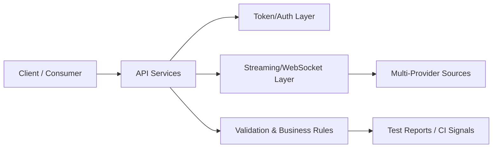

# .NET QA Engineering Portfolio


Backend-focused QA samples for fintech and real-time systems.

## Architecture Overview



## Test Strategy

- **Contract validation:** request/response schema and version safety
- **Business-rule checks:** pricing and provider consistency controls
- **Real-time checks:** reconnection, heartbeat, stale-data, failover behavior
- **Security-negative checks:** invalid token/access patterns and exposure prevention
- **Release-readiness:** repeatable tests for CI quality gates

## Repository Map

- `CoreTestSample/` - exchange-rate provider QA-related assets
- `NT KYC Jibit_/` - KYC client testing and integration samples

## Run Basics

```bash
dotnet restore
dotnet build
dotnet test
```

## Security Note

All public values are placeholders. Do not commit credentials, private feeds, or runtime secrets.
